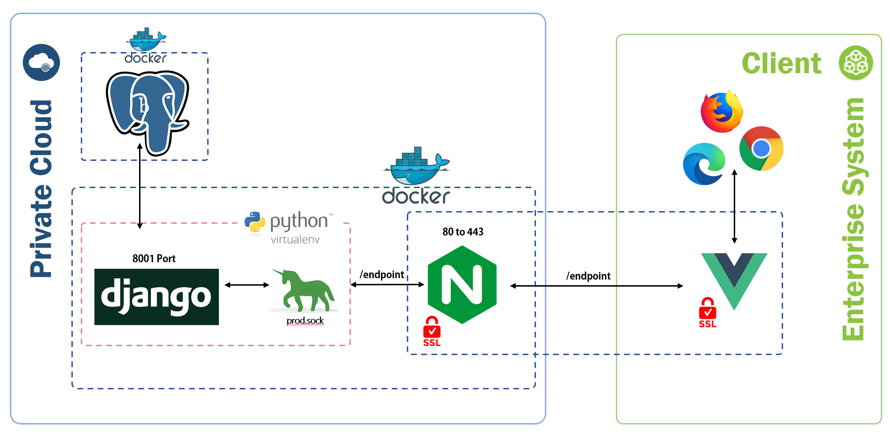
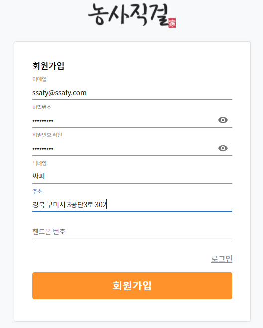
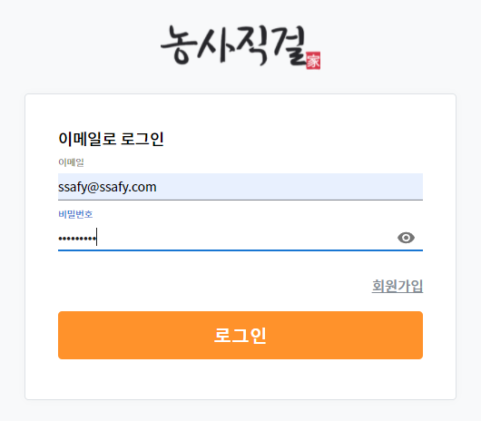
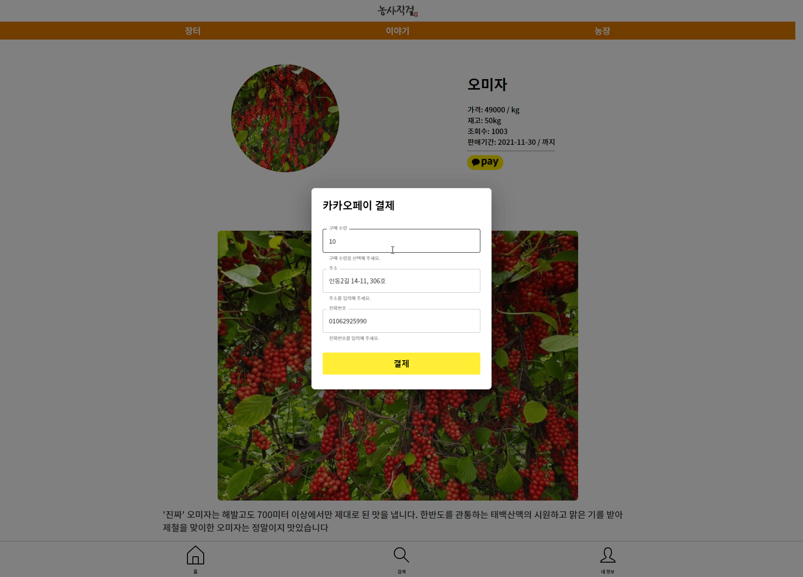
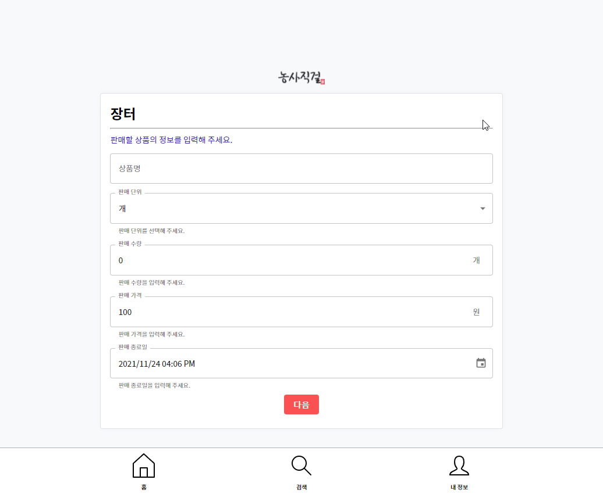
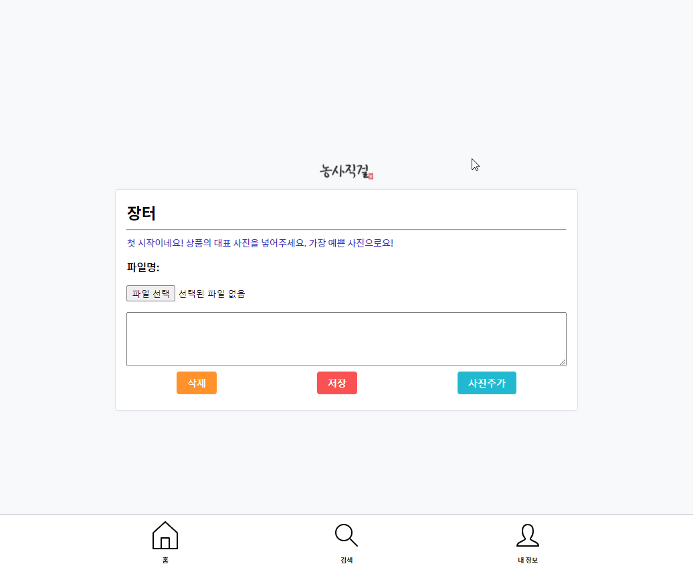
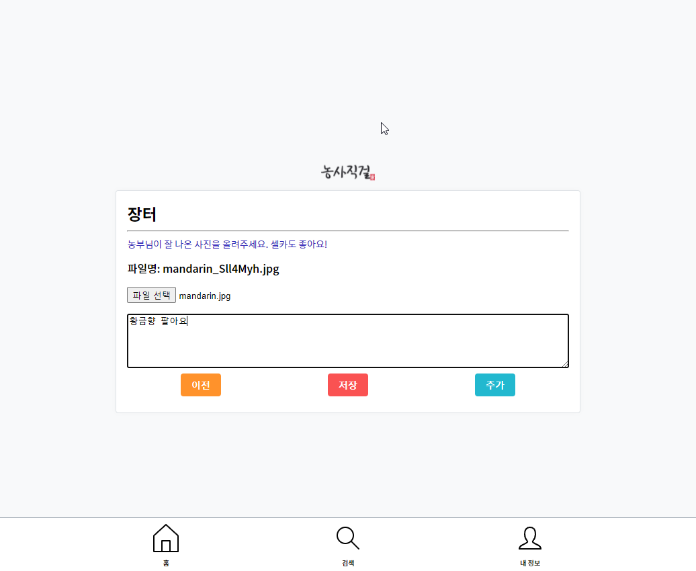
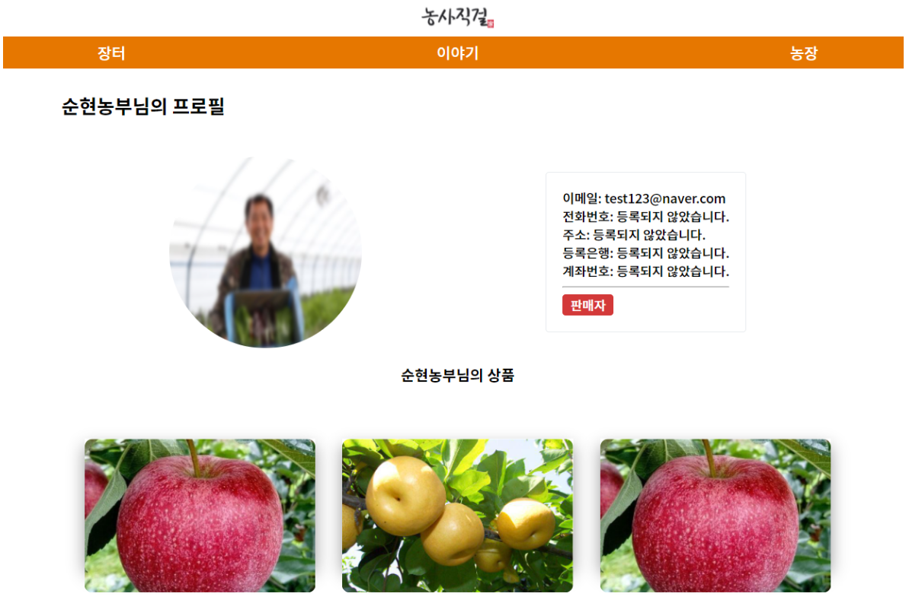

# 농사직걸

농부들의 일상 공유 + 농산물 직거래 플랫폼

정성들여 키운 농작물을 잘 팔고 싶지만, 사람들의 인지도도 부족하고 신뢰도도 낮아 판매하기가 쉽지 않은 농부들을 위한 서비스입니다.

생산품질에 자신이 있지만 신뢰도 및 인지도가 낮아 매출이 낮은 농부들이 생산과정을 담은 이야기를 보여줌으로써 소비자들이 판매자의 농산물에 대해 신뢰성 및 인지도를 가지게 해 소비자들은 좋은 농산물을 좋은 가격에 살 수 있고 판매자는 매출을 올릴 수 있는 구조를 생각했습니다.

## 서비스 특징, 기대 효과

1. 쉬운 판매글 작성
   - 농산물 직거래 플랫폼이라는 특성상 판매자의 주 연령층이 중,노년층이기때문에 아무래도 PC보다는 스마트폰 사용률이 더 높을거라고 판단해서 모바일에서도 편하게 볼 수 있도록 UI 디자인
   - 판매자 대부분이 디지털 소외계층이기 때문에 판매글이나 이야기를 올릴 때에도 최대한 쉽고 간편하게 작성하실 수 있도록 페이지를 구성
2. 소비자와의 심리적 거리 축소
3. 소비자가 저렴한 가격으로 고품질의 농산물을 구매

## UCC

[Youtube](https://www.youtube.com/watch?v=Aserty0F-Dk)

## Deploy

[https://k5d202.p.ssafy.io](https://k5d202.p.ssafy.io) [배포 중단]

## Requirements, Getting Started

`exec/Porting_manual.md`에 자세하게 정리해 두었습니다. `docker-compose`를 사용합니다.

## Screen shots

### Sign Up

### Sign in

### Main

### Markets: 판매 글

### Markets: Kakao 결제

### Markets: 간편한 에디터

### Storys: 농부들의 일상

### farm : 농부들의 프로필

### Profile

